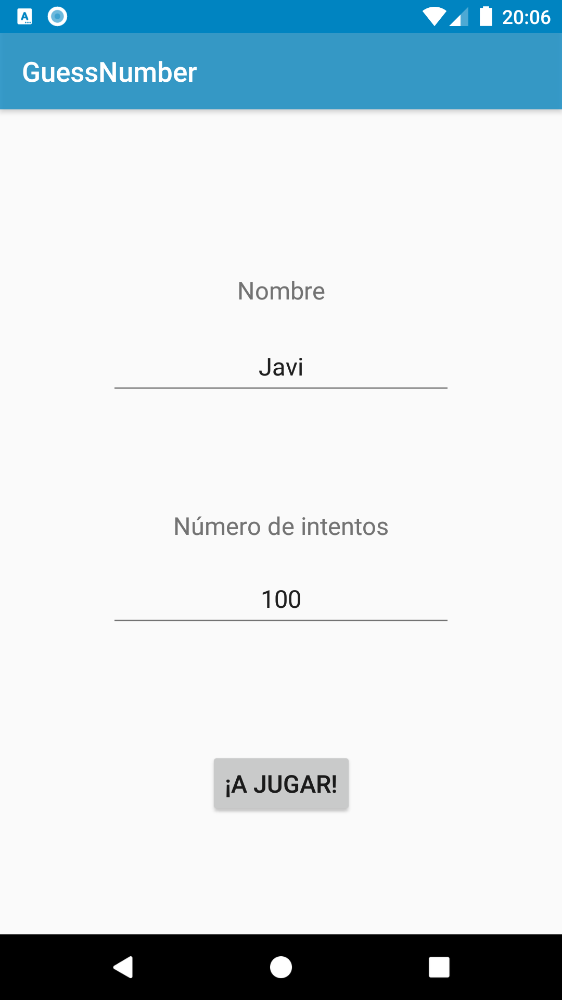

#  Proyecto GuessNumber

En este proyecto se ha desarrollado un simple juego en el que el usuario debe adivinar un número
entre el 1 y el 100. El proyecto se encuentra dividido en 3 `Activity`: `ConfigActivity`,
`PlayActivity` y `EndPlayActivity`.

ConfigActivity es la primera Activity que se muestra al usuario, quien debe introducir su nombre y
el número de intentos que quiere tener en la partida. Se controla que ambos campos estén rellenos
con datos válidos y se permite al usuario comenzar el juego con un botón.
El botón previamente mencionado lanza `PlayActivity`. Dentro de esta `Activity`, encontramos en
primer lugar un breve texto informando al usuario del objetivo del juego, seguido por un campo
editable en el que podrá escribir el número que crea. A continuación se encuentra un botón para
comprobar si ha acertado y un botón para resetear, desactivado por defecto. Lo siguiente es un campo
que informa al jugador de cuántos intentos le quedan, seguido por uno en el que se le informará de
si ha acertado o no, y en caso de haber fallado, si el número introducido es demasiado alto o
demasiado bajo. Por último, encontramos un botón para terminar el juego, que el usuario podrá usar
en cualquier momento independientemente de si ha ganado, perdido o quiere abandonar la partida.

Por último, encontramos `EndPlayActivity`, donde el usuario podrá encontrar un resumen de su
partida: el nombre, el número inicial de intentos, el número restante de intentos al terminar la
partida y el resultado de la misma.

Imagen de la primera `Activity`:

